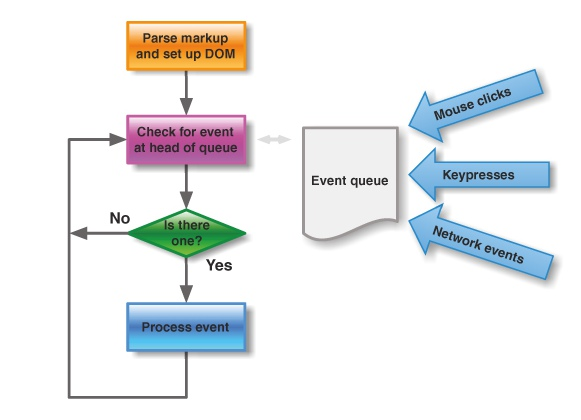

#### 官方文档说明   
https://segmentfault.com/a/1190000012861862
* 用法
```
 在下次DOM更新循环结束之后执行延迟回调。在修改数据值后立即使用这个方法，获取更新后得DOM
```
#### 异步说明
> Vue实现响应式并** 病逝聚聚发生变化值后DOM立刻变化 ** 而是按照一定的策略进行DOM更新
在 Vue 的[文档](https://cn.vuejs.org/v2/guide/reactivity.html#%E5%BC%82%E6%AD%A5%E6%9B%B4%E6%96%B0%E9%98%9F%E5%88%97)中，说明 Vue 是异步执行 DOM 更新的。关于异步的解析，可以查看阮一峰老师的[这篇文章](http://www.ruanyifeng.com/blog/2014/10/event-loop.html) .
具体来说，异步执行的运行机制如下。
> (1）所有同步任务都在主线程上执行，形成一个执行栈（execution context stack）。
>（2）主线程之外，还存在一个"任务队列"（task queue）。只要异步任务有了运行结果，就在"任务队列"之中放置一个事件。
>（3）一旦"执行栈"中的所有同步任务执行完毕，系统就会读取"任务队列"，看看里面有哪些事件。那些对应的异步任务，于是结束等待状态，进入执行栈，开始执行。
>（4）主线程不断重复上面的第三步。
下图就是主线程和任务队列的示意图。


#### DOM 更新循环是指什么
简单来说，Vue 在修改数据后，视图不会立刻更新，而是等同一事件循环中的所有数据变化完成之后，再统一进行视图更新
```
//改变数据
vm.message = 'changed'

//想要立即使用更新后的DOM。这样不行，因为设置message后DOM还没有更新
console.log(vm.$el.textContent) // 并不会得到'changed'

//这样可以，nextTick里面的代码会在DOM更新后执行
Vue.nextTick(function(){
    console.log(vm.$el.textContent) //可以得到'changed'
})
```
图解

> 事件循环：
第一个 tick（图例中第一个步骤，即'本次更新循环'）：

首先修改数据，这是同步任务。同一事件循环的所有的同步任务都在主线程上执行，形成一个执行栈，此时还未涉及 DOM 。
Vue 开启一个异步队列，并缓冲在此事件循环中发生的所有数据改变。如果同一个 watcher 被多次触发，只会被推入到队列中一次。
第二个 tick（图例中第二个步骤，即'下次更新循环'）：

同步任务执行完毕，开始执行异步 watcher 队列的任务，更新 DOM 。Vue 在内部尝试对异步队列使用原生的 Promise.then 和 MessageChannel 方法，如果执行环境不支持，会采用 setTimeout(fn, 0) 代替。

第三个 tick（图例中第三个步骤）：

此时就是文档所说的
> 下次 DOM 更新循环结束之后
此时通过 Vue.nextTick 获取到改变后的 DOM 。通过 setTimeout(fn, 0) 也可以同样获取到。
简单总结事件循环：

同步代码执行 -> 查找异步队列，推入执行栈，执行Vue.nextTick[事件循环1] ->查找异步队列，推入执行栈，执行Vue.nextTick[事件循环2]...

总之，异步是单独的一个tick，不会和同步在一个 tick 里发生，也是 DOM 不会马上改变的原因。
对于事件循环，可以在这里查看更详细的内容： https://segmentfault.com/a/1190000017204460
#### 下次更新循环是什么时候
#### 修改数据值后使用，是加快了数据更新进度吗？
#### 在什么情况下用到
>应用场景：需要在视图更新之后，基于新的视图进行操作。
需要注意的是，在 created 和 mounted 阶段，如果需要操作渲染后的试图，也要使用 nextTick 方法。

官方文档说明：
> 注意 mounted 不会承诺所有的子组件也都一起被挂载。如果你希望等到整个视图都渲染完毕，可以用 vm.$nextTick 替换掉 mounted
```
mounted: function () {
  this.$nextTick(function () {
    // Code that will run only after the
    // entire view has been rendered
  })
}
```
其他应用场景如下三例：
1.点击按钮显示原本以 v-show = false 隐藏起来的输入框，并获取焦点。
```
showsou(){
  this.showit = true //修改 v-show
  document.getElementById("keywords").focus()  //在第一个 tick 里，获取不到输入框，自然也获取不到焦点
}
修改为
showsou(){
  this.showit = true
  this.$nextTick(function () {
    // DOM 更新了
    document.getElementById("keywords").focus()
  })
}
```
2.点击获取元素宽度。
```
<div id="app">
    <p ref="myWidth" v-if="showMe">{{ message }}</p>
    <button @click="getMyWidth">获取p元素宽度</button>
</div>

getMyWidth() {
    this.showMe = true;
    //this.message = this.$refs.myWidth.offsetWidth;
    //报错 TypeError: this.$refs.myWidth is undefined
    this.$nextTick(()=>{
        //dom元素更新后执行，此时能拿到p元素的属性
        this.message = this.$refs.myWidth.offsetWidth;
  })
}
```
3.使用 swiper 插件通过 ajax 请求图片后的滑动问题。
[原文](https://segmentfault.com/a/119000001286186)
[vue nextTick深入理解－vue性能优化、DOM更新时机、事件循环机制](https://www.cnblogs.com/hity-tt/p/6729118.html)；
[JavaScript 运行机制详解：再谈Event Loop](http://www.ruanyifeng.com/blog/2014/10/event-loop.html)
[知乎：vue.js$nextTick的一个问题](https://www.zhihu.com/question/50879936)
[JS 事件循环机制 - 任务队列、web API、JS主线程的相互协同](https://www.cnblogs.com/hity-tt/p/6733062.html)
